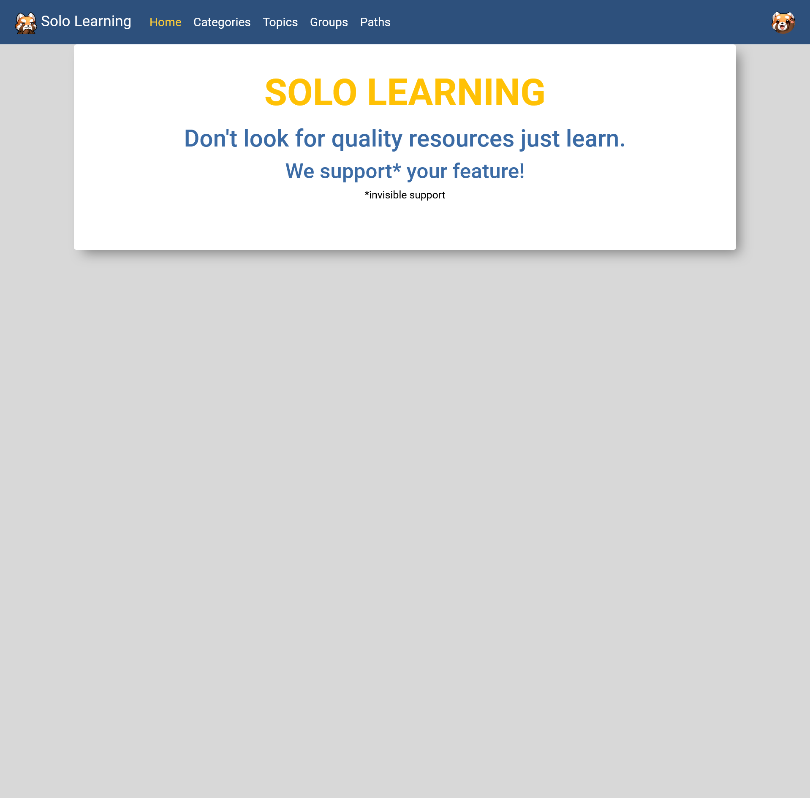
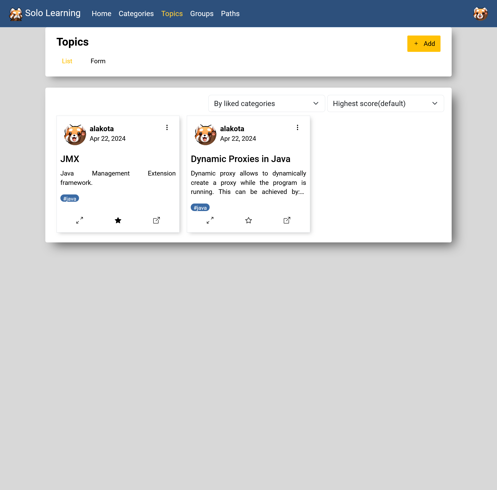

# Solo learning - frontend

## Table of Contents

* [General Info](#general-information)
* [Technologies Used](#technologies-used)
* [Setup](#setup)
* [Preview](#preview)

## General Information

The goal of the project was to write frontent application to this [backend-application](https://github.com/GrubeB/f13-learning).

## Technologies Used

- Angular 17

## Setup
### Development
1. Start development serve:

        ng serve

## Preview
Home

Categories view

Topic view

Topic form

Topic modal

Path modal

